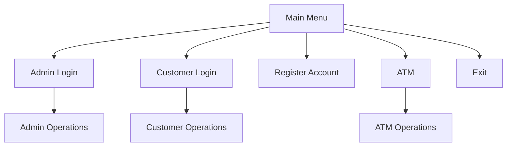

### Code:
```cpp
     void viewATMTransactions() {
        ifstream inFile("atm_transactions.txt");
        if (!inFile.is_open()) {
            cout << "\nNo ATM transactions found.\n";
            return;
        }

        cout << "\n----- ATM Transactions -----\n";
        string line;
        getline(inFile, line); // Skip header
        while (getline(inFile, line)) {
            if (line.empty()) continue;
            vector<string> tokens;
            string token;
            istringstream iss(line);
            while (getline(iss, token, '|')) {
                tokens.push_back(token);
            }
            if (tokens.size() < 4) continue;
            
            int accNo;
            double amt;
            stringstream(tokens[0]) >> accNo;
            string type = tokens[1];
            stringstream(tokens[2]) >> amt;
            string date = tokens[3];
            
            cout << "Account: " << accNo
                 << " | Type: " << type
                 << " | Amount: PKR " << fixed << setprecision(2) << amt
                 << " | Date: " << date << "\n";
        }
        inFile.close();
        cout << "------------------------------------------------------------\n";
    }

    bool adminLogin() {
        string user, pass;
        cout << "\nEnter admin username: ";
        cin >> user;
        cout << "Enter admin password: ";
        cin >> pass;

        if (admin.login(user, pass)) {
            cout << "\n ? Admin login successful.\n";
            return true;
        } else {
            cout << "\n ? Invalid admin credentials.\n";
            return false;
        }
    }

    // ---------- Customer Functions ----------
    void customerMenu(int accNo) {
        vector<Account> accounts = loadAllAccounts();
        bool found = false;
        Account cust;
        size_t idx = 0;
        while (idx < accounts.size()) {
            if (accounts[idx].getAccountNumber() == accNo) {
                found = true;
                cust = accounts[idx];
                break;
            }
            idx++;
        }
        if (!found) {
            cout << "\n ? Account not found.\n";
            return;
        }

        int choice;
        do {
            cout << "\n----- Customer Menu -----\n";
            cout << "1. Deposit Money\n";
            cout << "2. Withdraw Money\n";
            cout << "3. View Account Details\n";
            cout << "4. Apply for Loan\n";
            cout << "0. Logout\n";
            cout << "Enter choice: ";
            cin >> choice;

            if (choice == 1) {
                double amt;
                cout << "\nEnter amount to deposit (PKR): ";
                cin >> amt;
                cust.deposit(amt);
                size_t i = 0;
                while (i < accounts.size()) {
                    if (accounts[i].getAccountNumber() == accNo) {
                        accounts[i].setBalance(cust.getBalance());
                        break;
                    }
                    i++;
                }
                saveAllAccounts(accounts);
                logTransaction(accNo, "Deposit", amt);
            } else if (choice == 2) {
                double amt;
                cout << "\nEnter amount to withdraw (PKR): ";
                cin >> amt;
                if (cust.withdraw(amt)) {
                    size_t i = 0;
                    while (i < accounts.size()) {
                        if (accounts[i].getAccountNumber() == accNo) {
                            accounts[i].setBalance(cust.getBalance());
                            break;
                        }
                        i++;
                    }
                    saveAllAccounts(accounts);
                    logTransaction(accNo, "Withdraw", amt);
                }
            } else if (choice == 3) {
                cout << "\n----- Account Details -----\n";
                cust.display();
            } else if (choice == 4) {
                double loanAmt;
                cout << "\nEnter loan amount to apply for (PKR): ";
                cin >> loanAmt;
                if (loanAmt > 0) {
                    double rate = 5.0; // Fixed interest rate
                    cust.setLoanAmount(loanAmt);
                    cust.setInterestRate(rate);
                    size_t i = 0;
                    while (i < accounts.size()) {
                        if (accounts[i].getAccountNumber() == accNo) {
                            accounts[i].setLoanAmount(loanAmt);
                            accounts[i].setInterestRate(rate);
                            break;
                        }
                        i++;
                    }
                    saveAllAccounts(accounts);
                    cout << "\n ? Loan approved: PKR " << fixed << setprecision(2) << loanAmt
                         << " at " << fixed << setprecision(2) << rate << "% interest.\n";
                    logTransaction(accNo, "Loan", loanAmt);
                } else {
                    cout << "\n ? Invalid loan amount.\n";
                }
            } else if (choice == 0) {
                cout << "\n ? Logging out of customer menu...\n";
            } else {
                cout << "\n ? Invalid option. Try again.\n";
            }
        } while (choice != 0);
    }

    // ---------- ATM Functions ----------
    void atmMenu() {
        int accNo, pin;
        cout << "\nATM Login - Enter Account Number: ";
        cin >> accNo;
        cout << "Enter PIN: ";
        cin >> pin;

        vector<Account> accounts = loadAllAccounts();
        bool authenticated = false;
        Account user;
        size_t idx = 0;
        while (idx < accounts.size()) {
            if (accounts[idx].getAccountNumber() == accNo && accounts[idx].getPin() == pin) {
                authenticated = true;
                user = accounts[idx];
                break;
            }
            idx++;
        }
        if (!authenticated) {
            cout << "\n ? Invalid account number or PIN.\n";
            return;
        }

        int choice;
        do {
            cout << "\n----- ATM Menu -----\n";
            cout << "1. Check Balance\n";
            cout << "2. Withdraw Cash\n";
            cout << "3. View Recent Transactions\n";
            cout << "0. Exit ATM\n";
            cout << "Enter choice: ";
            cin >> choice;

            if (choice == 1) {
                cout << "\nCurrent Balance: PKR " << fixed << setprecision(2) << user.getBalance() << "\n";
            } else if (choice == 2) {
                double amt;
                cout << "\nEnter amount to withdraw (PKR): ";
                cin >> amt;
                if (user.withdraw(amt)) {
                    size_t i = 0;
                    while (i < accounts.size()) {
                        if (accounts[i].getAccountNumber() == accNo) {
                            accounts[i].setBalance(user.getBalance());
                            break;
                        }
                        i++;
                    }
                    saveAllAccounts(accounts);
                    logATMTransaction(accNo, "Withdrawal", amt);
                    user.setBalance(user.getBalance() - amt);
                }
            } else if (choice == 3) {
                displayLastTransactions(accNo);
            } else if (choice == 0) {
                cout << "\n ? Exiting ATM...\n";
            } else {
                cout << "\n ? Invalid option. Try again.\n";
            }
        } while (choice != 0);
    }

    // Check if account exists
    bool accountExists(int accNo) {
        vector<Account> accounts = loadAllAccounts();
        size_t i = 0;
        while (i < accounts.size()) {
            if (accounts[i].getAccountNumber() == accNo) {
                return true;
            }
            i++;
        }
        return false;
    }

public:
    void run() {
        cout << "\n=== Welcome to the Bank Management System ===\n";
        while (true) {
            cout << "\nMain Menu:\n";
            cout << "1. Admin Login\n";
            cout << "2. Customer Login\n";
            cout << "3. Register New Account\n";
            cout << "4. ATM\n";
            cout << "0. Exit\n";
            cout << "Enter choice: ";

            int choice;
            cin >> choice;

            if (choice == 1) {
                if (adminLogin()) {
                    int adminChoice;
                    do {
                        cout << "\n----- ADMIN MENU -----\n";
                        cout << "1. Add Customer\n";
                        cout << "2. View All Customers\n";
                        cout << "3. Modify Customer\n";
                        cout << "4. Reset Customer PIN\n";
                        cout << "5. Delete Customer\n";
                        cout << "6. Add Employee\n";
                        cout << "7. View All Employees\n";
                        cout << "8. Modify Employee\n";
                        cout << "9. Delete Employee\n";
                        cout << "10. View All Transactions\n";
                        cout << "11. View ATM Transactions\n";
                        cout << "0. Logout\n";
                        cout << "Enter choice: ";
                        cin >> adminChoice;

                        switch (adminChoice) {
                            case 1: addCustomer(); break;
                            case 2: viewAllCustomers(); break;
                            case 3: modifyCustomer(); break;
                            case 4: resetCustomerPIN(); break;
                            case 5: deleteCustomer(); break;
                            case 6: addEmployee(); break;
                            case 7: viewAllEmployees(); break;
                            case 8: modifyEmployee(); break;
                            case 9: deleteEmployee(); break;
                            case 10: viewAllTransactions(); break;
                            case 11: viewATMTransactions(); break;
                            case 0: cout << "\n ? Admin logging out...\n"; break;
                            default: cout << "\n ? Invalid option. Try again.\n";
                        }
                    } while (adminChoice != 0);
                }
            } else if (choice == 2) {
                int accNo, pin;
                cout << "\nCustomer Login - Enter Account Number: ";
                cin >> accNo;
                
                if (!accountExists(accNo)) {
                    cout << "\n ? Account not found. Please register first.\n";
                    continue;
                }
                
                cout << "Enter PIN: ";
                cin >> pin;

                vector<Account> accounts = loadAllAccounts();
                bool found = false;
                size_t idx = 0;
                while (idx < accounts.size()) {
                    if (accounts[idx].getAccountNumber() == accNo && accounts[idx].getPin() == pin) {
                        found = true;
                        customerMenu(accNo);
                        break;
                    }
                    idx++;
                }
                if (!found) {
                    cout << "\n ? Invalid PIN. Please try again.\n";
                }
            } else if (choice == 3) {
                addCustomer();
            } else if (choice == 4) {
                atmMenu();
            } else if (choice == 0) {
                cout << "\nThank you for using the Bank Management System. Goodbye!\n";
                break;
            } else {
                cout << "\n ? Invalid choice. Try again.\n";
            }
        }
    }
};

// =========================
// MAIN FUNCTION
// =========================
int main() {
    BankSystem bank;
    bank.run();
    return 0;
}
```

# Bank Management System - C++ Project Explanation By Rubab Waheed



## Project Overview
A comprehensive bank management system with admin, customer, and ATM interfaces implemented in C++. This system handles account management, transactions, loans, and ATM operations using file-based persistence.

## Features

### Core Functionalities
- **Admin Portal**:
  - Manage customers and employees
  - View all transactions
  - Reset customer PINs
- **Customer Portal**:
  - Deposit/withdraw funds
  - View account details
  - Apply for loans
- **ATM Interface**:
  - Cash withdrawals
  - Balance inquiries
  - Transaction history

### Technical Specifications
- **Language**: C++ 17
- **Storage**: File-based (text files)
- **Data Format**: Pipe-separated values
- **Error Handling**: Basic input validation

## Code Structure

### Key Components
| Component | Description |
|-----------|-------------|
| `BankSystem` | Main controller class |
| `Account` | Represents bank accounts |
| `Admin` | Handles admin authentication |
| `viewATMTransactions()` | Displays ATM transaction history |
| `customerMenu()` | Handles customer operations |
| `atmMenu()` | Implements ATM interface |
| `run()` | Main program loop |

### Detailed Function Explanations

#### 1. ATM Transaction Viewer
```cpp
void viewATMTransactions() {
    ifstream inFile("atm_transactions.txt");
    if (!inFile.is_open()) {
        cout << "\nNo ATM transactions found.\n";
        return;
    }

    cout << "\n----- ATM Transactions -----\n";
    string line;
    getline(inFile, line); // Skip header
    while (getline(inFile, line)) {
        // Parse and display transactions
    }
    inFile.close();
}
```

#### 2. Admin Authentication
```cpp
bool adminLogin() {
    string user, pass;
    cout << "\nEnter admin username: ";
    cin >> user;
    cout << "Enter admin password: ";
    cin >> pass;

    return admin.login(user, pass);
}
```

#### 3. Customer Operations
```cpp
void customerMenu(int accNo) {
    // Find account
    vector<Account> accounts = loadAllAccounts();
    // ...
    
    // Handle operations
    switch(choice) {
        case 1: // Deposit
        case 2: // Withdraw
        case 3: // View details
        case 4: // Apply for loan
    }
}
```

#### 4. ATM Interface
```cpp
void atmMenu() {
    // Authenticate user
    int accNo, pin;
    cin >> accNo >> pin;
    
    // Process ATM operations
    switch(choice) {
        case 1: // Check balance
        case 2: // Withdraw cash
        case 3: // View transactions
    }
}
```

# Bank Management System - C++ OOP Implementation


## OOP Concepts Implemented

###  Encapsulation
```cpp
// Account class (inferred)
class Account {
private:
    int accountNumber;
    double balance;
    int pin;
    
public:
    // Getters/setters for controlled access
    int getAccountNumber() const { return accountNumber; }
    double getBalance() const { return balance; }
    void setBalance(double newBalance) { balance = newBalance; }
};
```

###  Abstraction
```cpp
// Complex file operations hidden behind simple interfaces
void BankSystem::logATMTransaction(int accNo, string type, double amt) {
    // Handles file opening, formatting, writing, and closing
}

// User interacts with high-level menus
atmMenu();
customerMenu();
```

###  Classes & Objects
```cpp
// Class definitions
class BankSystem { /* ... */ };
class Account { /* ... */ };  // Inferred from usage
class Admin { /* ... */ };    // Inferred from usage

// Object instantiation
int main() {
    BankSystem bank;  // BankSystem object
    bank.run();       // Using object method
}
```

###  Data Hiding
```cpp
// Sensitive data accessed via methods
bool authenticated = false;
size_t idx = 0;
while (idx < accounts.size()) {
    if (accounts[idx].getAccountNumber() == accNo 
        && accounts[idx].getPin() == pin) {  // PIN not directly accessible
        authenticated = true;
        break;
    }
    idx++;
}
```

###  Code Reusability
```cpp
// Repeatedly used helpers
vector<Account> loadAllAccounts() { 
    // Loads accounts from file (used in 8+ locations)
}

// Generic transaction logger
void logTransaction(int accNo, string type, double amt) {
    // Handles both deposits/withdrawals and loans
}
```

## Key Features
- **Role-based access control** (Admin/Customer/ATM)
- **File-based persistence** for accounts/transactions
- **ATM simulation** with cash withdrawal
- **Loan management** with interest rates
- **Transaction auditing** for all operations
- **Admin dashboard** for user management

## Potential Improvements
1. **Security**  
    Implement PIN encryption instead of plaintext storage

2. **Polymorphism**  
    Create base `User` class with derived `Customer`/`Admin` classes

3. **Error Handling**  
    Add exception handling for file operations

4. **Performance**  
    Cache account data instead of repeated file reads

5. **UX**  
    Add input validation for numeric fields


> **Note**: The complete implementation requires supporting classes (`Account`, `Admin`) and file handling details not shown in the snippet ,they are in other snippets.


## How to Use

### Compilation and Execution
```bash
# Compile with g++
g++ -std=c++17 -o bank_system main.cpp 

# Run the executable
./bank_system
```

### Sample Workflow
1. **Admin Login**:
   - Username: `admin`
   - Password: `admin123` (configured in code)
   
2. **Customer Operations**:
   - Account Number: `1001`
   - PIN: `1234`

3. **ATM Transactions**:
   - Withdraw cash
   - Check balance

## Limitations and Future Improvements

### Current Limitations
1. **Data Security**:
   - PINs stored in plaintext
   - No encryption for sensitive data
   
2. **Performance**:
   - Entire account list loaded for every operation
   - Inefficient for large datasets

3. **Functionality**:
   - No funds transfer between accounts
   - No interest calculation on savings

### Recommended Improvements
| Area | Improvement |
|------|-------------|
| Security | Implement password hashing |
| Performance | Add database integration |
| Features | Add funds transfer capability |
| Error Handling | Add input validation |

## Conclusion
This bank management system provides a solid foundation for basic banking operations with clear separation between admin, customer, and ATM functionalities. While suitable for academic purposes, it requires security enhancements before production use.


